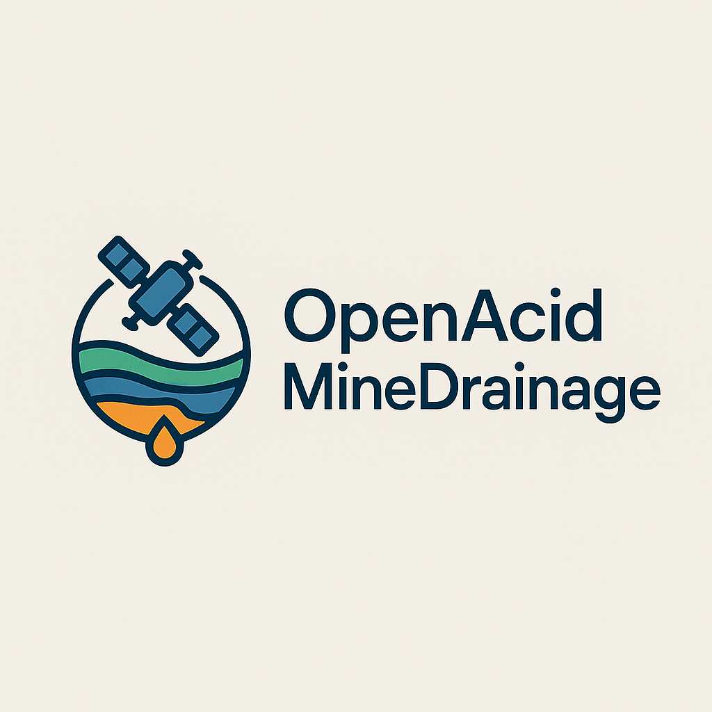

# OpenAcidMineDrainage

  
  

A comprehensive Python monitoring and analysis system that provides definitive evidence of environmental protection by tracking acid mine drainage (AMD) impacts on surrounding natural assets. The system integrates:

- Real-time water quality monitoring (pH, conductivity, dissolved metals, sulfate) at multiple upstream/downstream/control sites
- Advanced statistical analysis (ANOVA, regression analysis, time-series decomposition)
- Predictive ML forecasting for water quality under operational and environmental scenarios
- Hydrogeological modeling integration (FloPy/MODFLOW)
- Geochemical speciation modeling (PHREEQC via phreeqpy)
- Automated compliance reporting and real-time alerting
- Visualization dashboards and regulatory export

## Requirements
- Python >= 3.10

## Quickstart (with uv)
- Install uv if needed: https://docs.astral.sh/uv/
- Create and activate a virtualenv:
  - `uv venv`
  - `source .venv/bin/activate`
- Install (editable) with dev/test extras:
  - `uv pip install -e ".[dev,test]"`

## Quickstart (with pip)
- Create and activate a virtualenv:
  - `python3 -m venv .venv && source .venv/bin/activate`
- Upgrade pip and install:
  - `python -m pip install -U pip`
  - `pip install -e ".[dev,test]"`

## CLI usage examples
- Ingest CSV data and write cleaned dataset:
  - `oamd ingest data1.csv data2.csv --out artifacts/clean.csv`
- Run statistical analyses:
  - `oamd analyze artifacts/clean.csv --param pH`
- Forecast a parameter for a site:
  - `oamd forecast artifacts/clean.csv --param pH --site-id D1 --horizon 14 --out artifacts/forecast.csv`
- Generate compliance/impact report:
  - `oamd report artifacts/clean.csv --out artifacts/report.html`
- Run a small MF6 (FloPy) hydro scenario (writes inputs if mf6 missing):
  - `oamd hydro --workspace artifacts/mf6`
- Run a simple PHREEQC speciation example (requires phreeqpy):
  - `oamd geochem`

## FastAPI service
- Start with Docker Compose:
  - `docker compose up --build`
- Health check:
  - `curl http://localhost:8000/health`
- Analyze endpoint:
  - `curl -X POST http://localhost:8000/analyze -H 'Content-Type: application/json' -d '{"param":"pH","records":[]}'`
- Forecast endpoint:
  - `curl -X POST http://localhost:8000/forecast -H 'Content-Type: application/json' -d '{"site_id":"D1","param":"pH","horizon":14,"records":[]}'`

## Testing
- With tox (uses uv automatically via tox-uv):
  - `tox -q`
- Or directly:
  - `pytest -q`

## Project layout
- `src/oamd/` — package code (CLI, ingestion, analysis, ML, hydro, geochem, reporting)
- `tests/` — unit tests
- `artifacts/` — generated outputs (ignored by git)

## Notes
- Some integrations (MODFLOW executables, PHREEQC database) are optional and not required for core functionality. Commands detect missing external tools gracefully and still produce meaningful outputs.
